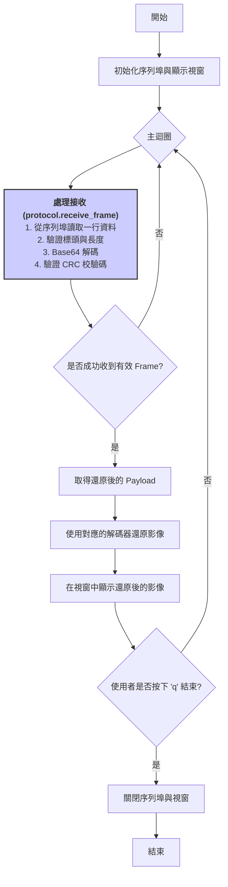

# 影像串流範例

此專案示範如何透過序列埠在電腦與微控制器（如 Arduino/ESP32）之間傳送影像幀。

## 專案結構

- `capture.py`：發送端。擷取攝影機影像、以 H.264/H.265/AV1/JPEG/Contour/YOLO 或自訂 Wavelet 編碼並透過自訂幀協定傳送。
- `main.py`：接收端。從序列埠讀取幀資料、驗證 CRC32、解碼 H.264/H.265/AV1/JPEG/Wavelet/Contour 與 YOLO 偵測框並顯示畫面。
- `protocol.py`：共享的幀協定工具，負責 ASCII 封包、CRC 驗證、分段 ACK 與降級處理。
- `h264_codec.py`：封裝 PyAV 的 H.264/H.265/AV1 編碼與解碼流程，並提供 JPEG、Contour、YOLO 偵測與自訂 Wavelet 編解碼器。
- `image_settings.py`：集中管理影像尺寸、位元率、關鍵幀與動態偵測等調校參數，修改此檔即可快速調整影像品質。
- `tests/test_protocol.py`：簡單的單元測試，確保幀協定的基本行為正確。

## 需求

- Python 3.10+
- OpenCV (`opencv-python`)
- PySerial (`pyserial`)
- NumPy (`numpy`)
- PyAV (`av`) — 需系統已安裝 FFmpeg 及 libx264 / libx265 / libaom-av1

可使用 `pip` 安裝：

```bash
python -m pip install opencv-python numpy pyserial av
```

## 使用方式

1. **啟動接收端**（建議先啟動）：
   ```bash
   python main.py
   ```
2. **啟動發送端**：
   ```bash
   python capture.py
   ```

   常用參數：

   - `--codec`：選擇 `h264` / `h265` / `av1` / `jpeg` / `wavelet` / `contour` / `yolo`；H.265、AV1 與 Wavelet 壓縮率較佳，JPEG 兼具高相容性，Contour 會以傅立葉係數傳輸物件輪廓，YOLO 只傳送人臉框的相對位置。
   - `--bitrate`：調整目標位元率，降低可節省頻寬。
   - `--keyframe-interval`：設定關鍵幀間隔，數值越大表示較少完整畫面。
   - `--motion-threshold`：畫面變化門檻，變化低於此值時跳過傳送。
   - `--max-idle`：最多可允許多久不傳送，超過則強制送一幀以維持同步。
   - `--jpeg-quality`：當選擇 `jpeg` 編碼時控制壓縮品質（1-100）。
   - `--contour-samples`：Contour 模式下的 r(θ) 採樣點數（愈高越精細，資料量也增）。
   - `--contour-coeffs`：Contour 模式下保留的傅立葉係數數量（愈高輪廓越準確）。
   - `--yolo-weights`：YOLOv5 權重檔（或模型名稱），例如 `yolov5n-face.pt`。
   - `--yolo-conf` / `--yolo-iou`：YOLOv5 偵測信心與 NMS IoU 門檻。
   - `--yolo-device`：YOLOv5 推論裝置（如 `cpu` 或 `cuda:0`）。
   - `--yolo-max-det`：單張影像保留的最大偵測框數。

按下 `q` 或 `Ctrl+C` 可結束程式。

## 單元測試

執行內建的協定測試：

```bash
python -m unittest tests/test_protocol.py
```

## 注意事項

- 預設會自動偵測第一個可用的序列埠。若環境中有多個裝置，可依需求調整 `protocol.auto_detect_serial_port`。
- 影像預設縮放後以 H.265 編碼（可改為 H.264、AV1、JPEG、Contour、YOLO 或 Wavelet），利用差分幀減少資料量並定期插入 I-frame 以保持同步。
- 若欲使用 YOLO 模式，請先準備對應的權重檔並安裝 `torch` 及 YOLOv5 依賴（程式會透過 `torch.hub` 載入）。
- 若系統未安裝 libx265 / libaom-av1 或裝置效能不足，可在啟動發送端時加入 `--codec h264` 改回 H.264 以維持相容性。
- 協定採用 ASCII 框架與 CRC32 校驗，並支援逐段 ACK（初始階段可自動降級為無 ACK 模式，以防止接收端尚未就緒時阻塞）。

## ESP32 韌體優化說明

本專案的 ESP32 韌體（`esp32_firmware/esp32_firmware.ino`）已針對穩定性與效能進行優化：

### 記憶體管理改善
- 使用固定大小的 `uint8_t` 陣列取代 Arduino `String` 類別，避免記憶體碎片化問題
- USB 緩衝區設定為 4096 bytes，LoRa 緩衝區設定為 512 bytes，適合大多數應用場景

### 錯誤處理機制
- 加入緩衝區溢出檢查，超過限制時自動重置並重新同步
- 異常情況下會輸出錯誤訊息，方便除錯

### 效能優化
- LoRa 資料採用批次讀取（最多 512 bytes），減少 `Serial.write()` 呼叫次數
- 使用 `delayMicroseconds(500)` 取代 `delay(1)`，降低迴圈延遲至 0.5ms
- 動態調整序列埠讀取大小，提升大型封包的傳輸效率

### 與 Python 端的整合
- ESP32 韌體完全透明轉發封包（包含同步標記 `\xDE\xAD\xBE\xEF`）
- Python 端的 `protocol.py` 在 `build_frame()` 中已加入同步標記，ESP32 無需額外處理
- 接收端的 `_synchronize()` 方法會自動搜尋同步標記，確保可靠的幀邊界偵測

## 程式流程圖
